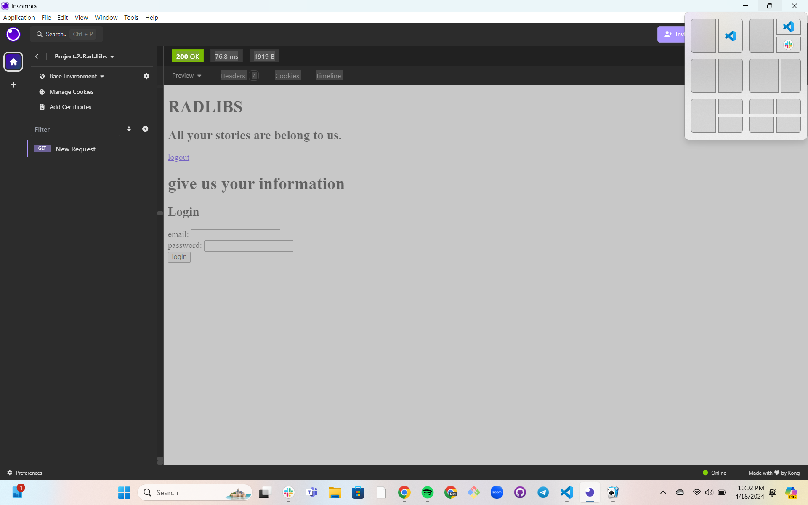

# Rad-Libs

## Description
Our RadLib generator is platform where you can create fun fill-in-the-blank word games from a variety of different stories. The website provides users with a short story or paragraph with certain words removed so that the user can input their own nouns, verbs, and adjectives to complete the story. Once the blanks are filled the user can hit the generate button to read the masterpiece they've created! Here is a reference where we had our inspiration from. https://www.madlibs.com/

## Visuals
The following image shows the web application's appearance. You can also go to the github by clicking the following link. https://github.com/jnelson4004/radlibs.git. To see the app deployed, you can go to heroku at https://radlibs-d563cd52f111.herokuapp.com/.

## Installation
Our installation process is as simple as clicking on our websites link navigation you to our project Radlibs! From there you can create your login information and start having fun!

## Usage
Our online platform is simple to use. You will start by putting in your email address and password, creating your account so that you can have access to the stories you have created. Then you will taken to our Radlib generator page where you will insert your choices of words that fill in the blanks for verbs, adjectives, and nouns. Finally, you will hit the generate button and your story will appear completed successfully.

## Support
For any support and updates on the website you may go to our github Radlib repo.(https://github.com/jnelson4004/radlibs)

## Roadmap
Ideas for releases in the future:
- Themed stories (camping, coding, holidays, etc.)
- Ability for the user to e-mail themselves their created Rad-libs
- Changing the database to a better fit for the usage of collecting user input for the radlibs
- Adding more front-end visuals to make it more visually appealing
- Updating code to fix all the bugs and issues

## Authors and acknowledgment
Our Authors are:
- Jack Nelson
- Chelle Wood
- Eddie Montoya

Notible contributers are:
- © 2024 edX Boot Camps LLC. Confidential and Proprietary. All Rights Reserved
- Torre Taylor(Instructor): assisted with how to structure database with stories and user input, connected api routes and handlebars.js to the front-end, helped with partial handlebars and getting login page to render
- Walter Perry(TA): input on how to pull data from user input and put into the database, then how to get inofrmation from the database to put into the radlib story
- Benicio Lopez(TA): assisted Eddie with MySQL and database code, and connected routes
- ChatGPT: for structuring database
- edX activity 22-Stu_MVC-Review: homeRoutes.js code
- edX activity 23-Ins_Auth-Review: for login code for user with email and password

## License
MIT License

## Project status
Our project is still a work in progress and will more updates to come in the future. We run into struggles like being able to deploy our project onto Heroku, getting the nouns, verbs, and adjectives to correspond to our blanks within our Radlib stories.
